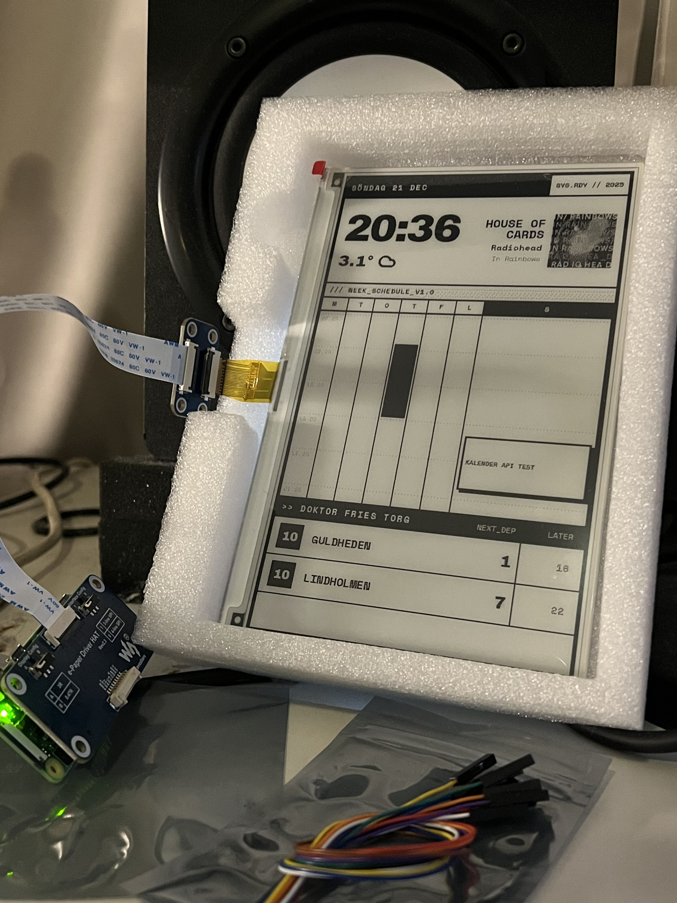
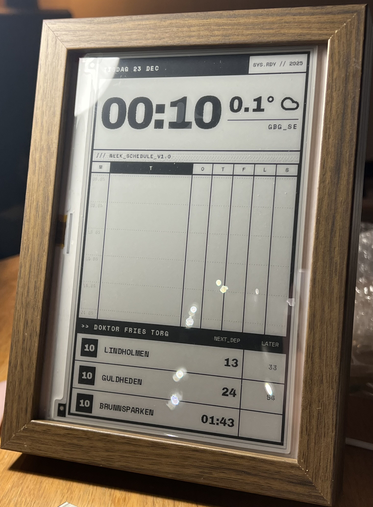

# TempusPi

An always on low power Raspberry Pi zero 2 w, Waveshare e-ink dashboard that displays real-time weather, calendar events, public transit departures, and currently playing Spotify music.

It fetches data from multiple APIs and renders them as a clean, customizable HTML dashboard optimized for e-paper displays.

## Features

- **Weather**: Current temperature and conditions via SMHI weather API (Sweden)
- **Calendar**: Upcoming events from ICS calendar feeds
- **Public Transit**: Live departure times from Västtrafik (Sweden)
- **Spotify**: Now playing track information
- **Multiple Layouts**: Various dashboard styles to choose from

## Project Structure

The project consists of:
- API fetchers for each data source (weather, calendar, transit, Spotify)
- HTML templates with different visual styles
- Display drivers for various Waveshare e-ink screens
- Main orchestrator that combines everything and updates the display

